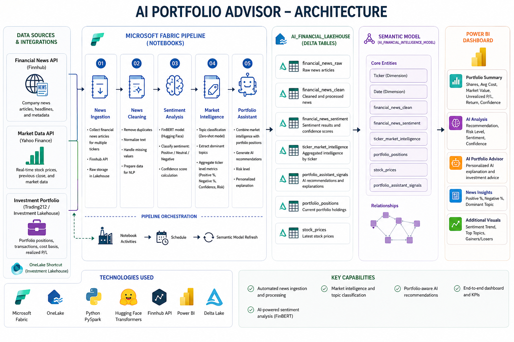
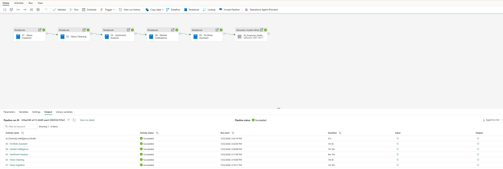
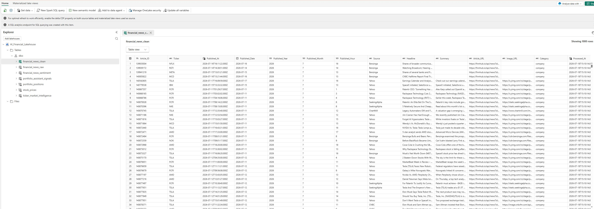
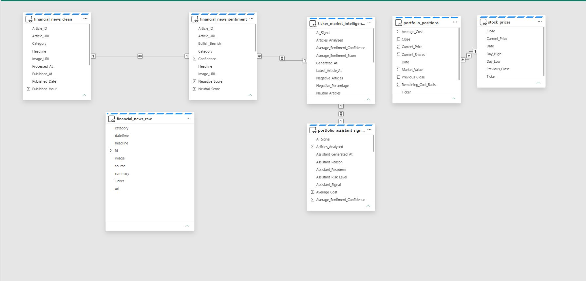
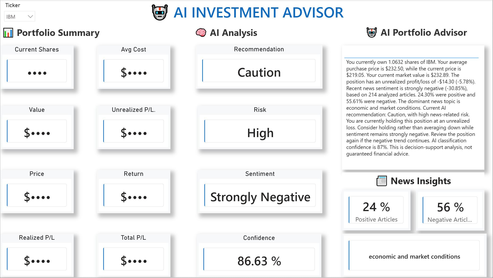

# 🤖 AI Financial Portfolio Advisor using Microsoft Fabric


An end-to-end **AI-powered investment decision support platform** built using **Microsoft Fabric**, **Python**, **Power BI**, and **Natural Language Processing (NLP)**.

The solution combines:

- 📈 Live market prices
- 📰 Financial news
- 🤖 AI sentiment analysis
- 📊 Portfolio analytics
- 💡 Personalized investment recommendations

into a single Microsoft Fabric analytics platform.

---

# 📖 Project Overview

Traditional investment dashboards focus primarily on historical prices and portfolio performance.

This project extends portfolio analytics by integrating Artificial Intelligence into the investment workflow.

The system automatically:

- Collects financial news from online sources
- Cleans and processes articles
- Performs sentiment analysis using FinBERT
- Identifies dominant market topics
- Calculates AI confidence scores
- Combines market intelligence with portfolio positions
- Generates personalized investment recommendations
- Presents everything inside an interactive Power BI dashboard

---

# 🏗️ Solution Architecture



---

# ⚙️ Technologies Used

- Microsoft Fabric
- Microsoft Fabric Lakehouse
- Microsoft Fabric Pipelines
- OneLake
- Delta Lake
- Power BI
- Python
- PySpark
- Pandas
- Hugging Face Transformers
- FinBERT
- Finnhub API
- Yahoo Finance

---

# ⚙️ Microsoft Fabric Pipeline

The complete solution is orchestrated using Microsoft Fabric Pipelines.

Pipeline activities include:

- News Ingestion
- News Cleaning
- Sentiment Analysis
- Market Intelligence
- Portfolio Assistant
- Semantic Model Refresh



---

# 🏠 Lakehouse

The AI Financial Lakehouse stores all processed Delta tables used by the solution.

Main tables:

- financial_news_raw
- financial_news_clean
- financial_news_sentiment
- ticker_market_intelligence
- portfolio_assistant_signals

Portfolio data is accessed using OneLake Shortcuts:

- portfolio_positions
- stock_prices



---

# 🗄️ Semantic Model

The Semantic Model connects all Lakehouse tables into a unified analytical model consumed by Power BI.



---

# 🤖 AI Workflow

The complete workflow is:

Trading212 Portfolio

⬇

Python ETL

⬇

Microsoft Fabric Lakehouse

⬇

Yahoo Finance

⬇

Finnhub News API

⬇

FinBERT Sentiment Analysis

⬇

Market Intelligence

⬇

AI Portfolio Assistant

⬇

Power BI Dashboard

---

# 📊 Dashboard Preview



---

# 💡 Dashboard Features

## Portfolio Summary

- Current Shares
- Average Cost
- Current Price
- Market Value
- Unrealized Profit/Loss
- Unrealized Return
- AI Confidence

---

## AI Analysis

Displays:

- Recommendation
- Risk Level
- Overall Sentiment
- AI Confidence

---

## AI Portfolio Advisor

Generates personalized explanations using:

- Portfolio positions
- AI sentiment
- Market intelligence
- Confidence score
- Risk assessment

---

## News Insights

Displays:

- Positive Articles %
- Negative Articles %
- Dominant News Topic

---

# 🧠 Artificial Intelligence

## Sentiment Analysis

Model:

- FinBERT

Outputs:

- Positive
- Neutral
- Negative

---

## Topic Classification

Zero-shot Classification

Examples:

- Artificial Intelligence
- Earnings
- Valuation
- Partnerships
- Regulation
- Market Conditions

---

# 📁 Repository Structure

```text
AI-Financial-Portfolio-Advisor/

├── dax/
├── docs/
├── images/
├── notebooks/
├── powerbi/
├── src/
├── README.md
├── requirements.txt
├── LICENSE
└── .gitignore
```

---

# 🚀 Skills Demonstrated

- Microsoft Fabric
- Power BI
- Python
- PySpark
- Delta Lake
- OneLake
- Microsoft Fabric Pipelines
- Semantic Models
- Data Engineering
- ETL Development
- Natural Language Processing
- Artificial Intelligence
- Financial Analytics
- Dashboard Design
- Business Intelligence

---

# 🔮 Future Improvements

- Real-time streaming using Eventstreams
- Large Language Model (LLM) explanations
- Machine Learning price forecasting
- Portfolio optimization
- Email alerts
- Mobile-friendly Power BI dashboard

---

# 🔒 Disclaimer

This repository has been prepared for demonstration purposes.

- Portfolio values have been anonymized.
- API credentials have been removed.
- Personal investment information is not included.

The AI-generated recommendations are intended solely for educational purposes and should not be interpreted as financial advice.

---

# 👨‍💻 Author

**Altin Salihi**

**Data Analyst | Business Intelligence Analyst**

### Technologies

Microsoft Fabric • Power BI • Python • SQL • Data Engineering • AI

---

⭐ If you found this project interesting, consider giving it a star.
